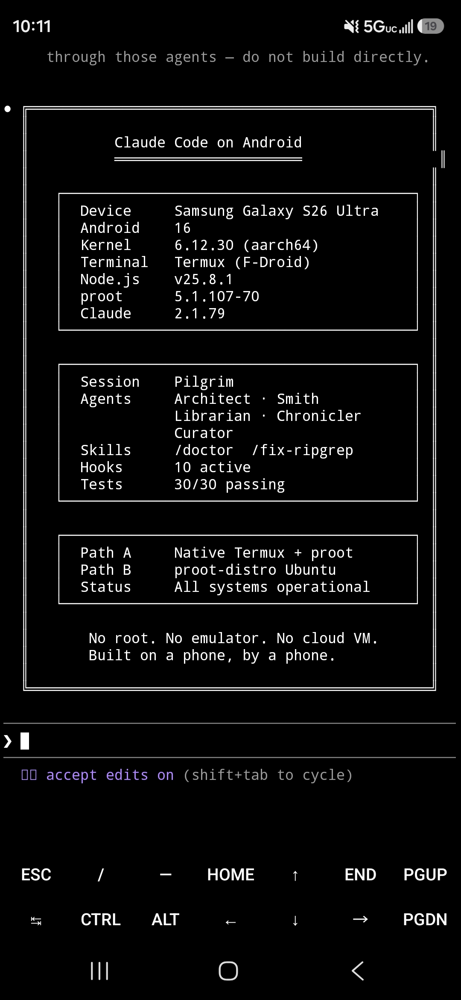
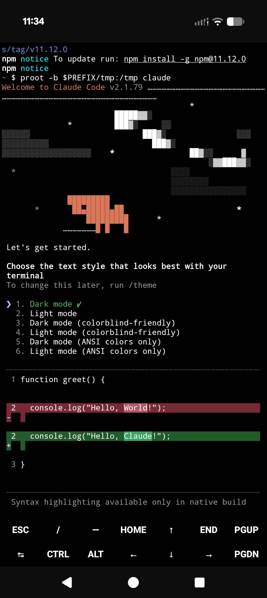

# Claude Code on Android

<p align="center">
  
</p>

<p align="center">
  <strong>Run Claude Code natively on Android. No root, no emulator, no cloud VM.</strong>
</p>

<p align="center">
  <strong>Claude Code</strong> is Anthropic's AI coding assistant that runs in your terminal. It reads files, writes code, runs commands, and manages projects, all through conversation. This repo gets it running on an Android phone.
</p>

<p align="center">
  
  &nbsp;&nbsp;&nbsp;
  
</p>
<p align="center">
  <em>S26 Ultra (Android 16) · Pixel 10 Pro (Android 17) · <a href="assets/">more screenshots</a></em>
</p>

<p align="center">
  <a href="LICENSE"></a>
  
  
  
</p>

<p align="center">
  <a href="docs/install.md">Install Guide</a> · <a href="docs/faq.md">FAQ</a> · <a href="docs/troubleshooting.md">Troubleshooting</a> · <a href="docs/security-model.md">Security Model</a> · <a href="docs/adb-wireless.md">ADB Wireless</a> · <a href="docs/avf-guide.md">Android Virtualization Framework (Path C)</a> · <a href="docs/constitution-template.md">CLAUDE.md Template</a>
</p>

---

> [!NOTE]
> **Already on an older pinned install?** If you set Path A up with a previous version of this repo (Claude Code `2.1.112`, pinned with the auto-updater off), you can move to the current auto-updating architecture without losing your sessions, login, or settings.
>
> See **[Upgrading from a pinned install](docs/install.md#upgrading-from-a-pinned-v2x-install)** for the steps.
>
> **Installing fresh instead?** Skip ahead to **[Quick Install](#quick-install)**.

## Before You Start

What you need in place before any command in this guide can succeed:

1. **An aarch64 (64-bit ARM) Android phone, Android 8 or later.** Most Android phones from 2018 onward qualify. A few budget Samsung A-series models ship a 32-bit OS on 64-bit hardware and will not work; see the [Troubleshooting entry on `armv7l` / `armv8l`](docs/troubleshooting.md#unsupported-architecture-armhf) if `uname -m` returns those once you have a terminal open.
2. **A Claude account** (Pro, Max, Team, Enterprise, or a Console / API account). Claude Code uses your existing Anthropic login.
3. **Termux installed from F-Droid or GitHub.** Termux is the terminal-emulator app the install commands below run in. The upstream Termux maintainers recommend F-Droid or their GitHub releases for most users. There is a Google Play build but as of the upstream README it is an experimental branch with missing functionality and bugs, and the upstream project recommends against it for most users. See [github.com/termux/termux-app](https://github.com/termux/termux-app) for the full install source breakdown and current caveats from the Termux maintainers themselves.

**If you have never used F-Droid or Termux before**, the upstream maintainers already cover the install steps better than this repo can:

- F-Droid (the open-source Android app store you install as an APK): [f-droid.org](https://f-droid.org/). The front page has the install instructions and the Play Protect prompt you may see on first launch.
- Termux on F-Droid: [f-droid.org/en/packages/com.termux/](https://f-droid.org/en/packages/com.termux/). You can install F-Droid first and then install Termux from inside it, or download the Termux APK directly from that page.
- Termux project (background, FAQ, troubleshooting): [github.com/termux/termux-app](https://github.com/termux/termux-app), [wiki.termux.com](https://wiki.termux.com/).

Once Termux is open you will see a prompt that looks like `~ $`. That is where the commands in Quick Install go. (Long-press to paste, or tap the on-screen Ctrl key then press V.)

Full prerequisites including the Termux:API source-matching rule: **[docs/install.md#prerequisites](docs/install.md#prerequisites)**.

---

## Quick Install

The repo documents three install paths. Pick one before pasting commands:

- **Path A (native Termux).** The official linux-arm64 claude binary, patched via Termux's glibc-runner (a Termux package that provides a working glibc and dynamic linker so Linux binaries can run on Android's Bionic-based system) to run on Android. A wrapper checks for new versions once per day on launch and updates transparently. About 5-10 minutes to install; the binary alone is ~233 MB, plus ~200 MB if you accept recommended packages.
- **Path B (proot-Ubuntu).** Latest Claude Code installed via Anthropic's official installer inside a full Ubuntu environment. Heavier (~2 GB on disk) but `process.platform` (the runtime identifier of the host operating system, which some tools branch on) reports `linux` and standard Linux conventions all apply.
- **Path C (AVF Linux VM, experimental, Pixel 6+ on Android 16+ only).** Real Linux kernel via Android's built-in hypervisor. Doesn't use Termux at all.

For a side-by-side comparison: **[docs/install.md#choose-your-path](docs/install.md#choose-your-path)**.

### Path A: Native Termux

```bash
curl -fsSL https://raw.githubusercontent.com/ferrumclaudepilgrim/claude-code-android/main/install.sh -o install.sh
bash install.sh
```

The installer asks two yes/no questions, then runs unattended. When it finishes, type:

```bash
claude
```

[`install.sh`](install.sh) installs Termux's `glibc-runner` and `patchelf-glibc`, downloads the official linux-arm64 claude binary from Anthropic's CDN, verifies the checksum against the published manifest, patches the binary's ELF interpreter (ELF is the Executable and Linkable Format used by Linux binaries; the interpreter is the dynamic linker the kernel invokes to load the binary, and patching it points the binary at the Termux-provided one) so Android can run it, and drops a wrapper at `$PREFIX/bin/claude` (where `$PREFIX` is Termux's prefix directory, typically `/data/data/com.termux/files/usr`) that auto-checks for new claude releases once per day on launch. The wrapper accepts a `--update-now` flag to force an immediate check; this is a Path A wrapper feature, not a built-in Claude Code flag. Want to read it first? **[View install.sh on GitHub](install.sh)** before running.

Full walkthrough: **[docs/install.md](docs/install.md)**.

> [!IMPORTANT]
> **Path A runs on a compatibility workaround.** Anthropic ships Claude Code as a glibc-linked Linux binary, with no Android build. Termux runs on Android's Bionic C library, so any version past the old pinned `2.1.112` runs here only because `install.sh` patches the official linux-arm64 binary to load through Termux's glibc-runner. It works and stays current, but it is a shim, not native support.
>
> The real fix is upstream. Anthropic has said they may add Android support, which would need either a `bun` `android-arm64` target or a static musl build. Until that ships, Path A depends on this patching step. Tracked at [anthropics/claude-code#50270](https://github.com/anthropics/claude-code/issues/50270).

### Path B: proot-Ubuntu

Latest Claude Code inside a full Ubuntu environment.

```bash
pkg install proot-distro -y
proot-distro install ubuntu && proot-distro login ubuntu
```

This may take a few minutes depending on connection speed.

Upon completion the prompt changes to something like:
```
root@localhost:~#
```
That means you are now inside Ubuntu rather than Termux. Inside Ubuntu:
```
apt update && apt upgrade -y
curl -fsSL https://claude.ai/install.sh | bash
echo 'export PATH="$HOME/.local/bin:$PATH"' >> ~/.bashrc && source ~/.bashrc
claude
```

Full walkthrough: **[docs/install.md#path-b-proot-distro-ubuntu](docs/install.md#path-b-proot-distro-ubuntu)**.

### Path C: AVF Linux VM (Pixel 6+ with Android 16+, experimental)

Real Linux kernel via the Android Virtualization Framework. No Termux involved.

On the phone, open Settings > System > Developer options and toggle **Linux development environment** on. If Developer options is not visible, enable it first: Settings > About phone > tap **Build number** 7 times. (You only have to do this once per phone.) If the Linux development environment toggle still does not appear after enabling Developer options, your device does not support this path.

Open the Terminal app that appears on the home screen. Accept the prompt to download the Debian image. When the prompt shows `droid@debian:~$`, install Claude Code inside the VM:

```bash
curl -fsSL https://claude.ai/install.sh | bash
export PATH="$HOME/.local/bin:$PATH"
echo 'export PATH="$HOME/.local/bin:$PATH"' >> ~/.bashrc && source ~/.bashrc
claude
```

The Terminal app's gear icon opens Settings, with Memory size, Display resolution, and Keep awake controls under **Advanced**. Full walkthrough including ADB hardware bridge, recovery, and known issues: **[docs/avf-guide.md](docs/avf-guide.md)**.

---

<details>
<summary><strong>What's In This Repo</strong> (click to expand)</summary>

### Guides

| Document | Covers |
|----------|---------------|
| [docs/install.md](docs/install.md) | Full step-by-step setup for all three paths, verification, maintenance |
| [docs/faq.md](docs/faq.md) | Install gotchas, path-choice questions, Android-version-specific behavior |
| [docs/troubleshooting.md](docs/troubleshooting.md) | Symptom-shaped entries: errors, hangs, failures with their fixes |
| [docs/skills.md](docs/skills.md) | Claude Code skills shipped in `.claude/skills/` and scripts under `scripts/` |
| [docs/adb-wireless.md](docs/adb-wireless.md) | ADB self-connect: setup, security model, capability table |
| [docs/security-model.md](docs/security-model.md) | Threat model: Termux:API permissions, ADB escalation, mitigations |
| [docs/agent-permissions.md](docs/agent-permissions.md) | No-agent-with-both-web-and-write permission matrix |
| [docs/ssrf-guard.md](docs/ssrf-guard.md) | WebFetch safety hook blocking private/reserved IPs |
| [docs/fingerprint-gate.md](docs/fingerprint-gate.md) | Biometric approval gate using `termux-fingerprint` |
| [docs/constitution-template.md](docs/constitution-template.md) | CLAUDE.md template with Android/Termux constraints baked in |
| [docs/avf-guide.md](docs/avf-guide.md) | AVF setup, VM configuration, ADB hardware bridge |
| [docs/sensors.md](docs/sensors.md) | NDK sensor access from Termux |

### Tools

| Item | Does |
|------|-------------|
| [install.sh](install.sh) | Path A installer (patched linux-arm64 binary + auto-updating wrapper) |
| [migrate.sh](migrate.sh) | Upgrade a pinned v2.x install to v2.9.0, preserving sessions, login, and settings |
| [scripts/](scripts/) | `check-termux-env.sh`, `config-validator.sh` |
| [.claude/skills/](.claude/skills/) | `minimum-viable`, `scope-framing`, `termux-safe` |
| [tests/](tests/) | `verify-claims.sh` (per-claim PASS/FAIL/SKIP harness); `ssrf-guard-tests.sh` |

### Project

| | |
|----------|---------------|
| [CHANGELOG.md](CHANGELOG.md) | Version history from 0.1.0 forward |
| [CONTRIBUTING.md](.github/CONTRIBUTING.md) | How to contribute, report bugs, submit device reports |

</details>

---

## Device Compatibility

Per-device last-verified dates below. The Path A architecture changed in v2.9.0 (from a pinned 2.1.112 npm install to a patched native linux-arm64 binary with auto-updating wrapper). Devices marked `v2.9.0` use the new architecture; devices marked `v2.x` retain the older verification under the previous pinned install (Path A v2.9.0 is expected to work, but is not yet re-verified on every device).

| Device | Android | Path A | Path B | Last Verified | Test artifact |
|--------|---------|--------|--------|---------------|---------------|
| Google Pixel 10 Pro | 17 | ✅ (v2.9.0, 2026-05-28) | ✅ | 2026-05-28 | [pixel-10-pro-android17.txt](tests/results/pixel-10-pro-android17.txt) |
| Google Pixel 6 | 17 | (pending v2.9.0 retest) | ✅ | 2026-05-16 (v2.x) | [pixel-6-android13.txt](tests/results/pixel-6-android13.txt) (v2.x) |
| Motorola Moto G7 Power | 10 | (pending v2.9.0 retest) | ✅ | 2026-05-16 (v2.x) | [moto-g(7)-power-android10.txt](tests/results/moto-g(7)-power-android10.txt) (v2.x) |
| Samsung Galaxy S7 (SM-G930P) | 8 | (pending v2.9.0 retest) | ✅ (manual URL paste) | 2026-05-16 (v2.x) | [sm-g930p-android8.0.0.txt](tests/results/sm-g930p-android8.0.0.txt) (v2.x) |
| Samsung Galaxy S26 Ultra | 16 | ✅ (v2.9.0, 2026-05-29, via migrate.sh) | ✅ | 2026-05-29 | doc-only (no current `tests/results/` file) |
| Samsung Galaxy S23+ | 15 | n/a | ✅ | 2026-03-19 | doc-only (no current `tests/results/` file) |

Path C (AVF) re-verified on Pixel 6 and Pixel 10 Pro running Android 17 on 2026-05-26; see [docs/avf-guide.md](docs/avf-guide.md). [Submit a device report](https://github.com/ferrumclaudepilgrim/claude-code-android/issues/new?template=device_report.md) if you've tested on hardware not listed.

---

## Alternative: Remote Control

If you have a desktop or laptop running Claude Code, [Remote Control](https://code.claude.com/docs/en/remote-control) lets you control it from your phone via QR code. Use Remote Control when you have a desktop nearby; use this repo when you want Claude Code running locally on your phone.

---

## MCP, Voice, PDF, ADB

These features work on Android with specifics covered in their own docs.

- **MCP:** Remote HTTP and local stdio transports work on both Path A and Path B. OAuth-based servers (servers that use the OAuth 2.0 authorization flow, which redirects through a browser to grant access tokens) depend on the Android browser being able to reach a localhost callback; reliability varies by path and device. See [troubleshooting](docs/troubleshooting.md).
- **Voice mode:** SoX (Sound eXchange, a command-line audio toolkit) → PulseAudio (the Linux sound server) → backend chain has worked on the devices I have tried, though some vendor builds break at the OpenSL ES (SLES) backend, the Android audio API that PulseAudio uses to reach the device speaker on older Android versions. Test before relying on it. Mic input is in flight via [termux-packages#29319](https://github.com/termux/termux-packages/pull/29319).
- **PDF reading:** Requires a `which` shim; see [troubleshooting](docs/troubleshooting.md#pdf-reading-fails-pdftoppm-is-not-installed).
- **ADB wireless self-connect:** Pair the phone to itself for system-level capabilities (screen capture, input injection, content queries). Full guide: [docs/adb-wireless.md](docs/adb-wireless.md).

---

## Contributing

Found a bug? Got it working on a new device? Know a better workaround?

- **Bug reports:** [Open an issue](https://github.com/ferrumclaudepilgrim/claude-code-android/issues/new?template=bug_report.md)
- **Device reports:** [Submit compatibility data](https://github.com/ferrumclaudepilgrim/claude-code-android/issues/new?template=device_report.md)
- **Improvements:** PRs welcome. See [CONTRIBUTING.md](.github/CONTRIBUTING.md).

---

## From the Maintainer

Erin here. I have updated the install script and made it interactive / more user friendly. This is with the goal to make it more accessible yet comprehensive. The install and migrate scripts themselves were tested by me on multiple devices.

I have been working on updating for a few days but with Opus 4.8 launching and my pinned version not updating I decided to go in and work with the workaround that was listed in [the issue](https://github.com/anthropics/claude-code/issues/50270). Did some modification and worked it into a shim that auto-updates. The original creator is acknowledged. I chose not to @ acknowledge as I am still unsure etiquette on this platform fully.

I migrated my daily driver using this script and so far I am running well. Enjoy all. I hope it works well.

[@ferrumclaudepilgrim](https://github.com/ferrumclaudepilgrim)  ·  Ferrum_Flux_Fenice  ·  Erin

---

## License

MIT. See [LICENSE](LICENSE).

## Built on and assisted by:

- **Claude Code** by [Anthropic](https://www.anthropic.com): [anthropics/claude-code](https://github.com/anthropics/claude-code)
- **glibc-runner / patchelf-glibc:** Termux's glibc-packages project that makes running linux-arm64 binaries on Android possible: [termux/glibc-packages](https://github.com/termux/glibc-packages)
- **The patched-binary approach** was originally described by [gtbuchanan](https://github.com/gtbuchanan) in a comment on [anthropics/claude-code#50270](https://github.com/anthropics/claude-code/issues/50270). This repo's `install.sh` is built on top of that work with empirical verification, the auto-updating wrapper, and the interactive prompts added.
- **Termux:** the Android terminal that makes all of this possible: [termux/termux-app](https://github.com/termux)

Maintained by [@ferrumclaudepilgrim](https://github.com/ferrumclaudepilgrim). Issues and pull requests welcome.
</content>
