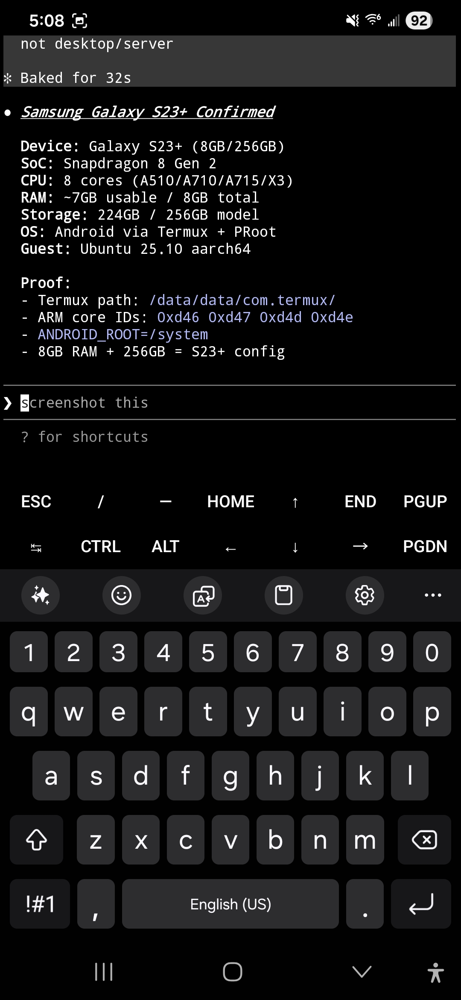

# Claude Code on Android

<p align="center">
  
</p>

<p align="center">
  <strong>Run Claude Code natively on Android — no root, no emulator, no cloud VM.</strong>
</p>

<p align="center">
  <strong>Claude Code</strong> is Anthropic's AI coding assistant that runs in your terminal. It reads files, writes code, runs commands, and manages projects — all through conversation. This repo gets it running on an Android phone.
</p>

<p align="center">
  
  &nbsp;&nbsp;&nbsp;
  
  &nbsp;&nbsp;&nbsp;
  
</p>
<p align="center">
  <em>S26 Ultra (Android 16) · S23+ (Android 15) · Pixel 10 Pro (Android 16) · <a href="assets/">more screenshots</a></em>
</p>

<p align="center">
  <a href="LICENSE"></a>
  
  
  
</p>

<p align="center">
  <a href="docs/install.md">Install Guide</a> · <a href="docs/troubleshooting.md">Troubleshooting</a> · <a href="docs/adb-wireless.md">ADB Wireless</a> · <a href="docs/constitution-template.md">CLAUDE.md Template</a> · <a href="docs/agents.md">Meet the Crew</a>
</p>

> **From the developer:** This guide looks long because we document every edge case we hit. The actual install is about 5 commands. If you just want to get started, jump straight to [Path B Quick Start](#path-b----recommended-full-linux-environment) and come back here when something breaks.

> Using ADB wireless debugging? Read the [security considerations](#adb-wireless-self-connect) first.

---

## Prerequisites

You need **Termux** installed from **F-Droid** (not the Play Store — the Play Store version hasn't been updated since 2020 and will not work).

> **Architecture check first.** Open any terminal and run `uname -m`. You need `aarch64` (64-bit ARM). If you see `armv7l` or `armv8l`, your device runs a 32-bit OS and Claude Code cannot work — no workaround exists. Some budget phones (Galaxy A13, A02S, M13) ship 32-bit Android on 64-bit hardware. See [Troubleshooting](docs/troubleshooting.md#unsupported-architecture-armhf).

### Install Termux

1. Download F-Droid from [f-droid.org](https://f-droid.org/en/). F-Droid is an app store for open-source Android apps — it's where the maintained version of Termux lives.
2. Open the downloaded APK. Android will block it. Go to **Settings → allow "install unknown apps"** from your browser.
3. After installing F-Droid, go back to Settings and **disable "install unknown apps"** from your browser. Keep it enabled only for F-Droid (it needs it to install apps).
4. Open F-Droid, search for **Termux**, install it.
5. Android may warn "unsafe app — built for an older version." Tap **More details → Install anyway**. This is safe — Termux targets an older API level for broader compatibility.

### Install Required Packages

Once Termux is open:

```bash
pkg upgrade -y
pkg install proot-distro -y          # Required for Path B (recommended)
pkg install android-tools -y         # Required for ADB self-connect
pkg install termux-api -y            # Required for device API access
```

Then install the **Termux:API** companion app from F-Droid (search "Termux:API"). Both the `termux-api` package and the companion app are required -- the package provides the commands (`termux-battery-status`, `termux-tts-speak`, `termux-notification`, etc.) and the companion app provides the Android permissions bridge. Without both, API calls fail silently.

> **Source matching rule:** Termux and Termux:API must come from the same source (both F-Droid or both GitHub releases). Mixing sources causes silent permission failures that are difficult to diagnose.

> **Already have Termux from F-Droid with packages installed?** Skip to Quick Start.

---

## Quick Start

There are two ways to install Claude Code on Android. Both require a [Claude Pro or Max subscription](https://www.anthropic.com/pricing).

**Most users should start here.**

### Path B -- Recommended (Full Linux Environment)

The cleanest setup. Installs Ubuntu inside Termux using proot-distro — think of it as a lightweight Linux environment running inside your phone's terminal. Claude Code runs in a standard Linux environment with no workarounds needed.

```bash
proot-distro install ubuntu
proot-distro login ubuntu
```

Inside Ubuntu:

```bash
apt update && apt upgrade -y
curl -fsSL https://claude.ai/install.sh | bash
echo 'export PATH="$HOME/.local/bin:$PATH"' >> ~/.bashrc && source ~/.bashrc
claude
```

Storage requirement: approximately 2 GB for the Ubuntu environment plus Claude Code.

> **Why `pkg upgrade` and `apt upgrade` first?** Without updated SSL libraries, the Claude Code installer returns 403. Both upgrades are required.

### Path A — Fully Viable with Node v25+

Faster setup (~2 min), less disk space, but requires workarounds that break on every Claude Code update.

```bash
pkg install nodejs git curl proot ripgrep -y
export TMPDIR=$PREFIX/tmp   # Critical: npm fails silently without this
npm install -g @anthropic-ai/claude-code
# Required: bare 'claude' will fail — always use this wrapper
proot -b $PREFIX/tmp:/tmp claude
```

Add this to `~/.bashrc` so it persists:

```bash
echo 'export TMPDIR=$PREFIX/tmp' >> ~/.bashrc
echo "alias claude-android='proot -b \$PREFIX/tmp:/tmp claude'" >> ~/.bashrc
source ~/.bashrc
```

> **Scripted install:** There's also a [one-command installer](install.sh) for Path A.

### Which Path Should I Use?

| | Path A (Native Termux) | Path B (Ubuntu in Termux) |
|---|---|---|
| Setup time | ~2 min (experienced) | ~10-15 min (experienced) |
| Disk usage | Minimal | ~2 GB |
| Install method | npm | Official Anthropic installer |
| Node.js required | Yes | No |
| /tmp workaround | Required every launch | Not needed |
| Ripgrep fix | Required, breaks on updates | Not needed |
| Ongoing maintenance | Re-fix after each update | Just update normally |
| Best for | Experienced users, light usage | Everyone else |

> **First timer?** Use Path B. Fewer things break.

### Your First Session

Once you've installed Claude Code and authenticated:

1. Create a project folder: `mkdir ~/myproject && cd ~/myproject`
2. Launch: `claude`
3. Try: "What files are in this directory?"
4. Type `/help` to see available commands
5. If you install the skills below, the `/doctor` skill (not the built-in `claude doctor`, which doesn't work in Termux) verifies your setup

---

## Why This Is Hard

Running Claude Code on Android means solving problems that don't exist on desktop. Quick summary:

- **/tmp does not exist.** Claude Code needs `/tmp` for sockets. Android has none. Path A uses `proot -b $PREFIX/tmp:/tmp`; Path B has `/tmp` natively. You can also set `CLAUDE_CODE_TMPDIR` to any writable directory.
- **Node.js v24 may hang.** Specific to v24 on native Termux (aarch64). v25+ resolves it. Path B avoids Node entirely.
- **Missing ripgrep binary.** Claude Code ships no ARM64 Android build. Path A needs a symlink workaround (`/fix-ripgrep` skill). Path B uses Ubuntu's ripgrep.
- **Platform detection mismatch.** Native Termux reports `android`; proot-distro Ubuntu reports `linux`. Some tools behave differently or fail depending on which they detect.
- **File paths vary by manufacturer.** External storage paths, sdcard symlinks, and `/proc` layouts differ across Samsung, Pixel, OnePlus, and others. Test file operations on your specific device rather than assuming paths from documentation.

---


## MCP (Model Context Protocol)

Two of three MCP transport types work on Android:

- **Remote HTTP servers** (e.g., Cloudflare) -- connect over HTTPS, zero local install. Best option for mobile.
- **Local stdio servers** (e.g., `npx -y @modelcontextprotocol/server-memory`) -- spawns child processes via npx. Tested with Node.js v25.8.1.
- **OAuth-based MCP servers** -- expected to fail. Termux provides `xdg-open` (symlink to `termux-open`) so browsers can launch, but OAuth redirect callbacks to `localhost` still fail because Termux has no loopback HTTP listener. Use token-based auth instead.

To add a remote MCP server:
```
claude mcp add --transport http <name> <url>
```

To add a local stdio server:
```
claude mcp add <name> -- npx -y <package>
```

---

## ADB Wireless Self-Connect

By connecting your phone to itself over ADB wireless debugging, Claude Code gains access to system capabilities that Android normally blocks from Termux. No root required. No computer needed.

### What ADB Unlocks

| Capability | Without ADB | With ADB |
|------------|------------|----------|
| Screenshots | Blocked | `adb shell screencap` |
| System settings (brightness, DND) | Blocked | `adb shell settings get/put` |
| Calendar events | Blocked | `adb shell content query` |
| Installed apps list | Blocked | `adb shell pm list packages` |
| Touch and gesture injection | Blocked | `adb shell input tap/swipe/text` |
| Process inspection | Termux processes only | `adb shell ps -A` (all processes) / `dumpsys` |
| Launch/stop apps | Partial | `adb shell am start/force-stop` |
| Device properties | Blocked | `adb shell getprop` |

These work alongside Termux API features (camera, TTS, clipboard, GPS, SMS, notifications, sensors, vibration) which don't need ADB at all.

> **Security warning:** ADB wireless debugging opens a network-accessible port on your device. Any device on the same WiFi network can attempt to pair. ADB requires a pairing code for every new connection, but the port is still exposed. **Enable wireless debugging only when you need it. Disable it when you're done. On public WiFi, it must be off.** The connection from Termux is localhost-only (`127.0.0.1`), so the ADB server itself does not listen on external interfaces from the Termux side, but the Android wireless debugging daemon does. This is the same risk every Android developer accepts when using wireless debugging. See [ADB-WIRELESS.md](docs/adb-wireless.md) for full security details.

### Quick Setup

```bash
# In Termux (not inside Ubuntu):
pkg install android-tools -y

# On your phone: Settings → Developer Options → Wireless Debugging → ON
# Tap "Pair device with pairing code" — note the IP:port and pairing code

adb pair 127.0.0.1:<pairing-port> <pairing-code>
adb connect 127.0.0.1:<connection-port>
adb devices   # Should show your device
```

ADB works from inside the Ubuntu guest too. Setup takes about 5 minutes. See **[ADB-WIRELESS.md](docs/adb-wireless.md)** for the complete guide, security details, and persistence notes.

> **Requires WiFi.** Android checks for a WiFi association (not internet access). ADB wireless disables automatically on mobile data.

---

## Alternative: Remote Control

If you have a desktop or laptop running Claude Code, [Remote Control](https://docs.anthropic.com/en/docs/claude-code/remote-control) lets you control it from your phone via QR code. No Termux needed.

**Use Remote Control** when you have a desktop nearby and want quick mobile access.
**Use this repo's approach** when you want Claude Code running locally on your phone with no desktop dependency.

---

## What's In This Repo

### Guides

| Document | What It Covers |
|----------|---------------|
| **[INSTALL.md](docs/install.md)** | Full step-by-step setup for both paths, verification, maintenance |
| **[TROUBLESHOOTING.md](docs/troubleshooting.md)** | 20+ common failures with symptoms, causes, and fixes |
| **[ADB-WIRELESS.md](docs/adb-wireless.md)** | ADB self-connect setup, security model, capability table |
| **[CONSTITUTION-TEMPLATE.md](docs/constitution-template.md)** | CLAUDE.md template with Android/Termux constraints baked in |
| **[SENSORS.md](docs/sensors.md)** | NDK sensor access from Termux -- 9 of 11 standard types confirmed, plus Samsung vendor sensors |
| **[SSRF-GUARD.md](docs/ssrf-guard.md)** | WebFetch safety hook blocking private/reserved IP ranges |
| **[AGENT-PERMISSIONS.md](docs/agent-permissions.md)** | Permission separation guide -- no agent gets both web and write access |
| **[FINGERPRINT-GATE.md](docs/fingerprint-gate.md)** | Biometric approval gate for sensitive operations using `termux-fingerprint` |

### Tools & Config

| Item | What It Does |
|------|-------------|
| **[install.sh](install.sh)** | One-command installer for Path A |
| **[.claude/skills/](.claude/skills/)** | 8 Claude Code skills — Android diagnostics and workflow tools |
| **[tests/](tests/)** | Verification suite — tests documentation claims against your device |

### Project

| Document | What It Covers |
|----------|---------------|
| **[CHANGELOG.md](CHANGELOG.md)** | Version history from 0.1.0 to 2.4.0 |
| **[CONTRIBUTING.md](.github/CONTRIBUTING.md)** | How to contribute, report bugs, submit device reports |
| **[AGENTS.md](docs/agents.md)** | The 6 AI agents that build and maintain this repo |
| **[STORY.md](docs/story.md)** | How this project came together |

---

## Device Compatibility

| Device | Android | Path A | Path B | ADB | Last Verified |
|--------|---------|--------|--------|-----|---------------|
| Samsung Galaxy S26 Ultra | 16 | Works | Works | Works | 2026-03-19 |
| Google Pixel 10 Pro | 16 | Works | Works | Untested | 2026-03-19 |
| Samsung Galaxy S23+ | 15 | Untested | Works | Untested | 2026-03-19 |
| Samsung Galaxy S24/S25 | 15-16 | Untested | Untested | Untested | — |
| Google Pixel 8/9 | 15-16 | Untested | Untested | Untested | — |
| OnePlus 12/13 | 14-15 | Untested | Untested | Untested | — |

**Verified** means install, authentication, and basic operations tested end-to-end on real hardware. Test results: [tests/results/](tests/results/)

**Tested on your device?** [Submit a device report](https://github.com/ferrumclaudepilgrim/claude-code-android/issues/new?template=device_report.md) to help fill in the gaps.

---

## PDF Reading

### PDF reading requires `which` shim

Claude Code's PDF reader checks for `pdftoppm` using `which`, but Termux doesn't ship a `which` binary.

See [Troubleshooting: PDF reading](docs/troubleshooting.md#pdf-reading-fails-pdftoppm-is-not-installed) for the fix.

---

## Known Constraints

Running on a phone means real limits. Path B (Ubuntu) resolves some of them.

| Constraint | Impact | Workaround |
|-----------|--------|-----------|
| No root | No `sudo`, no ports below 1024 | Use ports 1024+, skip anything needing root |
| No systemd | No system services manager. `crond` works in both native Termux and Ubuntu for scheduled tasks. Termux:Boot runs scripts at device startup. Shell scripts and `termux-job-scheduler` provide additional automation. | Use `crond`, Termux:Boot, or shell scripts |
| ~512MB Node.js heap | Large datasets must stream | Process incrementally, don't buffer |
| File descriptor limits | Heavy I/O can hit limits on some devices | Limit concurrent processes. Check with `ulimit -n` |
| Phantom process killer | Android may kill excess background processes | Disable in Developer Options if available, or limit background processes |
| /tmp is volatile (Path A) | proot crash = mount gone | Path B avoids this. Don't store persistent state in /tmp |
| WiFi required for ADB | ADB wireless disables on mobile data | Re-connect when back on WiFi |

See [TROUBLESHOOTING.md](docs/troubleshooting.md) for detailed fixes.

---

## Skills

This repo includes [Claude Code skills](https://docs.anthropic.com/en/docs/claude-code/skills) for Android and general-purpose workflow.

### Android / Termux

| Skill | What It Does |
|-------|-------------|
| `/doctor` | Diagnose your full Termux + Claude Code setup in one pass (not `claude doctor`, which doesn't work in Termux) |
| `/fix-ripgrep` | Fix broken search tools (missing ARM64 Android binary) |
| `termux-safe` | Auto-loaded rules preventing `sudo`, wrong paths, silent failures |

See [all skills](docs/skills.md) including workflow tools that work in any environment.

### Installing Skills

Copy them to your home directory so they work in any project:

```bash
cd ~
git clone https://github.com/ferrumclaudepilgrim/claude-code-android.git
mkdir -p ~/.claude/skills
cp -r claude-code-android/.claude/skills/* ~/.claude/skills/
ls ~/.claude/skills/
rm -rf claude-code-android   # Clean up — phone storage is finite
```

---

## The CLAUDE.md Template

Claude Code reads a CLAUDE.md file from your project root for persistent rules. The [template](docs/constitution-template.md) in this repo is designed for Android and Termux — it includes platform constraints, safety rules, and agent configuration for up to 6 concurrent agents.

---

## The Agents

This repo is built and maintained by 6 specialized AI agents running concurrently on a single phone. See [Meet the Crew](docs/agents.md) for the full roster and how they work.

---

## Contributing

Found a bug? Got it working on a new device? Know a better workaround?

- **Bug reports:** [Open an issue](https://github.com/ferrumclaudepilgrim/claude-code-android/issues/new?template=bug_report.md)
- **Device reports:** [Submit compatibility data](https://github.com/ferrumclaudepilgrim/claude-code-android/issues/new?template=device_report.md)
- **Improvements:** PRs welcome. See [CONTRIBUTING.md](.github/CONTRIBUTING.md).

---

## About This Project

This repo is built and maintained using Claude Code running on the same Android device it documents — the tool documenting itself, on the platform it's documenting. The operator ([FerrumFluxFenice](https://github.com/FerrumFluxFenice)) guides the work, Claude Code builds it, and every claim is verified on real hardware.

Claude Code is made by [Anthropic](https://www.anthropic.com). Official repo: [anthropics/claude-code](https://github.com/anthropics/claude-code).

## License

MIT. See [LICENSE](LICENSE).

---

**A note from the developer:**

Thank you to anybody reading this. I hope you enjoy my repo and have success utilizing it. I am exploring the intricacies of development, GitHub (and git in general), learning and growing. This is a passion project of mine and I update it regularly as I plan to further my usage of Claude Code on Android and in the process contribute back to Termux, which is what made all of this possible. I am a 100% part-time indie doing this because I enjoy it.

If you find something broken, have a question, or want to contribute, [open an issue](https://github.com/ferrumclaudepilgrim/claude-code-android/issues) or submit a PR. Every bit helps.

Built on [Termux](https://github.com/termux).

[@ferrumclaudepilgrim](https://github.com/ferrumclaudepilgrim)

---

<p align="center">
  <em>Built on a phone, in Termux, on ARM64, on Android.</em><br>
  <em>By a human and an AI, working together.</em><br>
  <em>v2.4.0</em>
</p>
